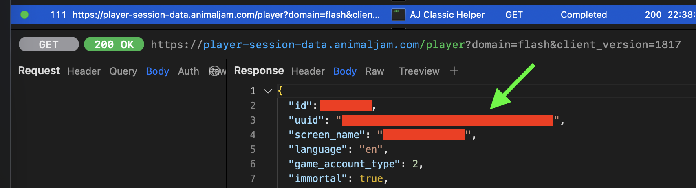

# AJART PNG Tool
A browser-based Animal Jam art conversion tool for converting .ajart files to PNG images, and encoding PNGs to .ajart.

## Implementation
- derive an AES key and IV from the provided UUID
  > A valid UUID is of the format: `xxxxxxxx-xxxx-xxxx-xxxx-xxxxxxxxxxxx`
- decrypt .ajart with AES-128-CBC
- decompress the AMF3 payload
- extract PNG data from AMF3 content

When encoding a PNG, the AMF construction assumes h=aja2id.

## Capturing your UUID
The UUID is unique to each Animal Jam account, and is needed to decrypt the .ajart file. You must capture your network traffic while logging into Animal Jam.

1. Download and set up [Proxyman](https://proxyman.com/).
2. Start capturing traffic in Proxyman.
3. On the same computer, log into Animal Jam.
4. Stop the capture.
5. Look for a request/response similar to the example shown below, which displays your account UUID.

## Credits
This project is based on [ajart-studio-edit](https://github.com/v31l-sys/ajart-studio-edit) by **v31l-sys**.
